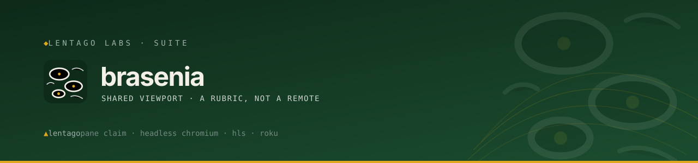

<!-- Lentago Labs brand header — generated by lentago/.github → brand/generate.py.
     Regenerate there; do not hand-edit the banner or badge URLs. -->
<a href="https://lentago.dev"></a>

[](https://github.com/lentago/brasenia/actions) [](https://github.com/lentago/brasenia/blob/main/LICENSE)

   

# brasenia

Brasenia (watershield) carpets New England ponds with small floating leaves —
little panes resting on the water's surface. **brasenia** is the Lentago Labs
shared viewport: one always-on wall display whose content is chosen by a
**rubric, not a remote**. Panes surface when there's something worth showing —
a PR awaiting review, a failing backup, a deploy in flight — and sink back
when they resolve; the daily morning brief is the resting surface underneath.
Today it drives a 32" Roku TV via a live HLS stream; the pane bus and
compositor are the roadmap.

*(Renamed from `lunaria` on 2026-07-20, hours after creation — Lunaria annua
is a European garden escape, and the Lentago codename roster is New England
natives only.)*

**Authorship:** The code and documentation in this repo are co-written with
[Claude](https://claude.ai) (Anthropic). I direct the work and review the
output; Claude writes the code and prose. I'm an infrastructure operator, not a
software engineer — please don't read this repo as a portfolio of coding
ability.

## 🧭 What this repo demonstrates

brasenia is a *product* repo with no build step — so the interesting patterns are in how change
is governed, not in a pipeline. Each row links to the evidence in this checkout.

| Pattern | How it shows up here |
|---|---|
| **Required check gates every merge** — PR-gated change as a hard control, not a norm | The branch ruleset on `main` requires the `docs-check / docs-check` context to pass; merges are squash-only with force-push and deletion blocked. The check itself is [`.github/workflows/docs-check.yml`](.github/workflows/docs-check.yml). |
| **Shared reusable workflow, not copy-pasted CI** — the DRY lesson for platform teams | [`docs-check.yml`](.github/workflows/docs-check.yml) is a thin wrapper: `uses: lentago/shared-workflows/.github/workflows/docs-check.yml@v1.2.3`. Fleet CI logic lives in one place, consumed at an immutable semver tag (shared-workflows ADR-0005); fixes arrive as a reviewable tag bump. |
| **Least-privilege agent** — scoped permissions and an explicit command allowlist | [`.github/workflows/claude.yml`](.github/workflows/claude.yml) grants only `contents`/`pull-requests`/`issues`/`id-token`/`actions:read` and passes an `allowed_tools` allowlist of specific `git`/`gh` commands to a bot that can push and open PRs. |
| **Reversible pause, documented** — turn automation off without losing its config | [`claude-code-review.yml`](https://github.com/lentago/brasenia/blob/538813043f84809a44819b087c98abb448b606f2/.github/workflows/claude-code-review.yml) was switched from `pull_request` to `workflow_dispatch` with a dated `>>> DISABLED 2026-06-25 <<<` rationale, then retired once CodeRabbit became the org-wide advisory reviewer; the repo-specific review prompt is preserved at that permalink for re-enabling. |
| **Ownership boundary encoded in docs** — app repo vs. infra-as-code repo | The [What's deliberately elsewhere](#whats-deliberately-elsewhere) table and [`CLAUDE.md`](CLAUDE.md) draw the line: product/concept/client here, runtime/provisioning in [`kalmia`](https://github.com/lentago/kalmia). It's a convention, not code-enforced. |
| **Branding as code** — one generator, no per-repo drift | The header comment at the top of this file marks the banner + badge rows as generated by `lentago/.github → brand/generate.py`; you regenerate there, never hand-edit. |
| **Secrets stay out of the repo** — concrete hygiene tied to a real deploy | [`scripts/deploy-roku.sh`](scripts/deploy-roku.sh) reads `ROKU_IP` and `ROKU_DEV_PASS` from the environment only; [`CLAUDE.md`](CLAUDE.md) forbids committing or baking either into the script. |
| **Honest rename debt** — legacy names flagged and linked, not quietly left | Both this README and [`CLAUDE.md`](CLAUDE.md) cite [kalmia#63](https://github.com/lentago/kalmia/issues/63) for the still-pending `lunaria → brasenia` runtime rename, rather than silently blessing the inconsistency. |

## What's here

- `docs/concept.md` — the product concept: pane / rubric / compositor model,
  the pane contract, rubric v1, the bus contracts (Contracts v1), migration
  phases.
- [`docs/adr/`](docs/adr/) — architecture decisions, reconstructed 2026-08-13
  from repo history and fleet records.
- `roku-app/` — the BrightScript dev channel the TV runs: a full-screen HLS
  `Video` node with the **mandatory auto-retry handler** (a bare Video node
  never recovers from a publisher restart; this one rejoins ~1 s after the
  stream returns).
- `compositor/` — the Phase 2 compositor (stdlib Python 3.9+): ranks the
  pane bus by rubric v1 and publishes `viewport/current.json`, the pointer
  every client follows; falls back to the briefing, then a status card. Run
  as `python3 -m compositor --webroot /srv/www`; tests with
  `python3 -m unittest discover -s tests` from `compositor/`.
- [`producers/`](producers/) — pane producers for the viewport bus; today
  [`producers/focus/`](producers/focus/), which turns fresh session beacons
  into one open-pull-requests pane per repo.
- `scripts/deploy-roku.sh` — zip + sideload via the Roku dev installer
  (digest auth; credentials via environment, never committed).

## What's deliberately elsewhere

Brasenia follows the fleet's separation of product from provisioning:

| Piece | Where it lives |
|---|---|
| LXC 118 guest definition | [`kalmia`](https://github.com/lentago/kalmia) `terraform/containers.tf` (CI-applied) |
| Runtime stack (mediamtx, shooter/rotator/encoder scripts, systemd units) | [`kalmia`](https://github.com/lentago/kalmia) `roles/lunaria/` + `docs/lunaria.md` |
| Brief publishing (Google Drive → `pub.lan`, the only credentialed leg) | [`kalmia`](https://github.com/lentago/kalmia) `roles/pub/` |

(kalmia's role, docs, and the container hostname still carry the `lunaria`
name from before the rename — completing it through runtime is owned by
[kalmia#63](https://github.com/lentago/kalmia/issues/63) under the fleet
rename discipline: legacy names are tracked debt, never permanent.)

The running container is **credential-free by design**: its only input is
`http://pub.lan/`. This repo owns the concept, the TV client, and (Phase 2)
the compositor.

## How it works today (Phase 1)

```
 claude.ai routine (8:08 ET) → Google Drive → pub (LXC 114) → http://pub.lan/brief/
      ▼
 viewport LXC (118, pve4): headless Chromium shoots the TV edition →
      720p bands rotate through frame.png → ffmpeg (image2pipe, H.264+AAC)
      → mediamtx → HLS :8888
      ▼
 Roku dev channel (this repo's roku-app/) → 32" play-room TV
```

Glass-to-glass latency runs 7–17 s depending on playlist join depth; the whole
chain survives publisher restarts unattended. Validation evidence and the
operational gotchas (mediamtx `?cookieCheck=1` redirect, Roku retry behavior,
headless-Chromium cache staleness) are summarized in `docs/concept.md`.

## Roadmap

- **Phase 2 (in progress)** — NAS pane bus (`web/viewport/panes/<pane>/` +
  `manifest.json`, created 2026-10-07) and the rubric compositor, running on
  pub (LXC 114) and publishing `http://pub.lan/viewport/current.json`.
  Compositor v1 ([`compositor/`](compositor/)) implements rubric v1; its
  runtime unit is [kalmia#140](https://github.com/lentago/kalmia/issues/140).
  Briefing and Grafana become the first two pane classes, with per-repo
  `focus` panes from the session heartbeat.
- **Phase 3** — governance snippet rolls out to all local Claudes and the
  claytonia fleet; panes start arriving from real activity (PR queue, job
  status, HA alerts).

## 🛠️ Make a change yourself

These systems are real, and nothing critical rides on them. That makes this a
safe place to try a change before you make the same kind of change in your own
shop. Pick one:

**Add a required CI check via the shared-workflows pattern.**
Edit a workflow in [`.github/workflows/`](.github/workflows/) to call a reusable workflow from
`lentago/shared-workflows` (or change the reusable workflow itself), then open a PR. The branch
ruleset requires that check's context to pass before merge — so the change first proves itself on
its own PR, the same way `docs-check` now guards every markdown edit here. No apply happens on
merge; the payoff is the gate itself.
**Proof this works:** [#6 — Adopt the shared docs-check workflow](https://github.com/lentago/brasenia/pull/6).

**Evolve the product concept or client through review-gated PRs.**
Edit `docs/concept.md`, the README, the Roku app, or the validation artifacts on a branch and open
a PR; `docs-check` runs and must pass, and there are no direct pushes to `main`. Runtime or
provisioning changes for the same feature are filed separately in kalmia — never forked into this
repo, per the ownership split above.
**Proof this works:** [#1 — Rename product lunaria → brasenia](https://github.com/lentago/brasenia/pull/1),
[#2 — Cite kalmia#63 for the runtime rename](https://github.com/lentago/brasenia/pull/2),
[#3 — Preserve the 2026-07-20 HLS validation artifacts](https://github.com/lentago/brasenia/pull/3).

**Repoint what the wall display actually shows (cross-repo — *not* applied from this repo).**
brasenia owns the Roku client and the stream-URL contract only; nothing here has a CI-applied
runtime effect. To change the displayed content you edit kalmia's `lunaria_tv_url` (and
`terraform/containers.tf` or `roles/lunaria/`) and open a PR *there*: kalmia's terraform workflow
applies on merge to `main` via the LAN self-hosted runner, and then a manual on-host `play` run
repoints the running stream. Merging in brasenia updates the repo and docs — never the live TV.
This vector needs write access to the [`kalmia`](https://github.com/lentago/kalmia) repo and access
to the homelab runner.

---

> 🌱 **Lentago Labs** is a pro-bono operations practice for organizations that
> run on volunteers, donations, and one overworked tech person. Everything here
> is free to take, and we practice what we publish: our own estate runs this
> way, in the open. Start at the [org profile](https://github.com/lentago).
